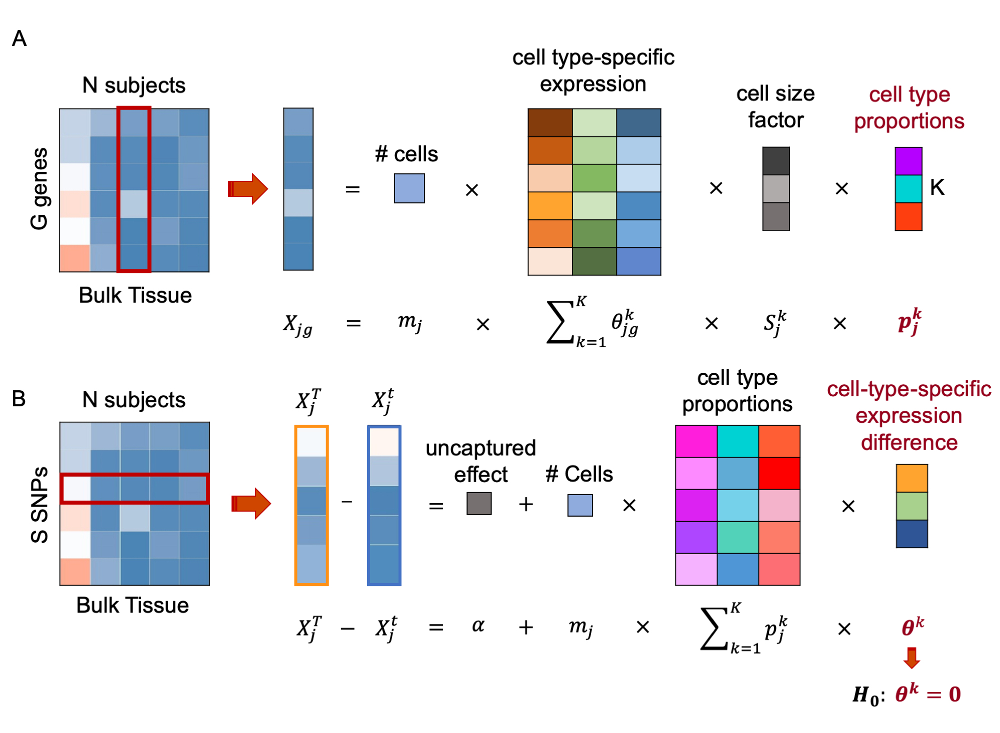

```{r, echo=FALSE, message=FALSE}
library(knitr)
library(DT)
library(kableExtra)
library(xbioc)
```

```{r pre, echo=FALSE,message=FALSE}
#library(devtools)
#install_github("cboettig/knitcitations")
#require(knitcitations)
#bib <- read.bibtex("reference.bib")

# install.packages("citr")
#library("citr")
#md_cite("Wang 2019", bib_file = "reference.bib")

#%\VignetteEngine{knitr::rmarkdown}
#%\VignetteIndexEntry{Vignette Title}
#%\VignetteEncoding{UTF-8}
```

This vignette provides a walk through tutorial on how to use `BSCET` to characterize cell-type-specific allelic expression imbalance (AEI), and the association of cell-type-specific AEI with clinical factors by integrative analysis of bulk and single cell RNA sequencing (RNA-seq) data. `BSCET` involves two steps. First, we infer cell type proportions in the bulk RNA-seq samples by incorporating cell-type-specific gene expression information provided by a scRNA-seq reference. Second, for each heterozugous transcribed SNP, `BSCET` aggregates allele-specific read counts from the bulk RNA-seq data across individuals to model cell-type-specific expression difference between two alleles by linear regression, and tests for the evidence of cell-type-specific AEI.

<style>
figure{
  text-align: center;
}
</style>

<figure>
<p align="center"> 
{width="60%"}
</p>
</figure>

Below, using the human pancreas datasets, we demonstrate `BSCET` step by step.

## Step 1: Estimating cell type proportions by deconvolution

In this step, we aim to infer cell type proportions in the bulk RNA-seq samples by incorporating cell-type-specific gene expression information provided by a scRNA-seq reference. This can be achieved by cell type deconvolution algorithms such as MuSiC [@music]. Following MuSiC, we deconvolve bulk RNA-seq data of 89 subjects from @fadista using single cell reference obtained from @seger. The detailed tutorial of MuSiC [@music] can be found on [this page](https://xuranw.github.io/MuSiC/articles/MuSiC.html). 

### Data preparation

MuSiC [@music] takes a bulk RNA-seq data that contain a mixture expression of various cell types, and a scRNA-seq data that include the single cell expression from multiple samples as input. Both datasets should be in the form of `ExpressionSet`, a convenient data structure to hold expression data along with sample/feature annotation. The details of constructing ExpressionSet can be found on [this page](https://www.bioconductor.org/packages/release/bioc/vignettes/Biobase/inst/doc/ExpressionSetIntroduction.pdf). 

```{r step1_data_pre, message=FALSE}
library(MuSiC)
## Bulk RNA-seq data
fadista.eset = readRDS("./GSE50244bulkeset.rds")
fadista.eset

## scRNA-seq data
seger.eset = readRDS("./EMTABesethealthy.rds")
seger.eset
```

### Cell type deconvolution

We constrained our analysis on 6 well-studied cell types: acinar, alpha, beta, delta, ductal and gamma. 

```{r step1, message=FALSE}
music_result = music_prop(bulk.eset = fadista.eset, sc.eset = seger.eset, clusters = 'cellType',
                               samples = 'sampleID', 
                          select.ct = c('acinar','alpha', 'beta', 
                                        'delta','ductal','gamma'), verbose = F)
est.prop = music_result$Est.prop.weighted
```

Below shows the estimated cell type proportions for the 89 bulk samples obtained from MuSiC [@music].

```{r step1.1, echo=FALSE}
datatable(round(est.prop,3), class = 'cell-border stripe', rownames = TRUE, 
          options = list(pageLength = 5, fixedColumns = T, dom='rtp', pagingType = "numbers",
                         columnDefs = list(list(className = 'dt-center', targets = 0:5))))
```

Although we illustrated `Step 1` using estimated cell type proportions obtained from MuSiC [@music], however, `BSCET` is not limited to MuSiC and one can infer cell type compositions using other methods, such as CIBERSORT [@cibersort], in this step.

## Step 2: Detecting cell-type-specific AEI

Given the estimated cell type proportions obtained in `Step 1`, for each heterozygous transcribed SNP, `BSCET` aggregates allele-specific read counts of the bulk RNA-seq data across heterozygous individuals and detects cell-type-specific AEI of the SNP.

For individual $j$, let $X_j^T$ and $X_j^t$ be the read counts for the reference and alternative alleles of the transcribed SNP, respectively. The difference of two allele-specific reads can be expressed as:

$$X_j^T-X_j^t = \alpha+m_j\sum_{k=1}^Kp_j^kS_j^k\theta^k+\epsilon_j \;\;\;\;\;\;\;\;\;\;\;\;\;(1)$$

where the intercept $\alpha$ captures the allelic expression difference not explained by the selected $K$ cell types; $m_j$ is the total number of cells in the bulk tissue for individual $j$; $S_j^k$ is the subject-specific average cell size of cell type $k$ and can be approximated by the sample mean, $S^k$; $p_j^k$ is the individual-specific proportion of cells from cell type $k$; $θ^k$ represents allelic expression difference between two alleles of the transcribed SNP for cell type $k$; $\epsilon_j$ is random error and assumed to follow $N(0,\sigma^2)$. 

To detect cell-type-specific AEI in the population, for cell type $k$, we test the following hypothesis:

$$H_0: \theta^k=0  \;\; vs \;\;  H_1: \theta^k \neq 0$$

using a t statistic. Details of `BSCET` can be found in the Method section of [our manuscript](https://www.biorxiv.org/content/10.1101/2020.08.26.267815v1).

### Data preparation

`BSCET` analyzes one transcribed SNP at a time. In this section, we will walk you through on how to generate input data for `BSCET`. 

First, we obtained the allele-specific read count of the SNP, i.e, $X_j^T$ and $X_j^t$. The input allelic bulk RNA-seq data are in form of text file and should contain columns: 

* `SNP`: character, the name or chromosome location of each heterozygous transcriobed SNP;
* `id`: character, individual identifier;
* `ref`: numeric, the SNP-level allele-specific read counts of the reference allele;
* `alt`: numeric, the SNP-level allele-specific read counts of the alternative allele;

The tables below show an example allelic RNA-seq data of SNP chr1:22336305.

```{r step2, echo=FALSE, message=FALSE}
DATA = read.table('example_data.txt',header=T)
dat = DATA[,c('SNP','id', 'ref','alt')]
dat$`count difference` = dat$ref-dat$alt
datatable(dat, class = 'cell-border stripe', rownames = FALSE, 
          options = list(pageLength = 5, fixedColumns = T, dom='rtp', pagingType = "numbers",
                         columnDefs = list(list(className = 'dt-center', targets = 0:3))))
```

Second, we calculate the subject-specific total number of cells in the bulk tissue, i.e., $m_j$. As $m_j$ is not observed for the bulk data, we esimate it using the individual-specific library size factor, which can be obtained by the function `estimateSizeFactor` of DESeq2 [@deseq]. A detailed tutorial of DESeq2 [@deseq] can be found on [this page](http://master.bioconductor.org/packages/release/workflows/vignettes/rnaseqGene/inst/doc/rnaseqGene.html).

```{r deseq, message=FALSE,warning=FALSE}
library(DESeq2)
expmat <- exprs(fadista.eset)
coldata = matrix(colnames(expmat),ncol=1)
colnames(coldata) = 'id'
rownames(coldata) = colnames(expmat)
dds <- DESeqDataSetFromMatrix(countData = expmat,
                              colData = coldata,
                              design = ~ id)
dds <- estimateSizeFactors(dds)
mj = sizeFactors(dds)
head(mj)
```

Third, we obtained the subject-specific cell type compositions of the bulk tissue, i.e., $p_j^k$, which can be estimated using cell type deconvolution showed in `Step 1`. Given both $m_j$ and $p_j^k$, for each individual $j$, we can calculate their $m_jp_j^k$, showed in the table below.

```{r data, echo=FALSE, message=FALSE}
est.prop = est.prop[names(mj),]
mp = est.prop*mj
datatable(round(mp,3), class = 'cell-border stripe', rownames = TRUE, 
          options = list(pageLength = 5, fixedColumns = T, dom='rtp', pagingType = "numbers",
                         columnDefs = list(list(className = 'dt-center', targets = 0:5))))
```

Finally, we combine $m_jp_j^k$ with the allele-specific reads, $X_j^T$ and $X_j^t$, and obtain the input data of `BSCET` as the following:

```{r data1, echo=FALSE, message=FALSE}
mp = cbind('id'=rownames(mp),mp)
dat = merge(dat, mp, by='id')
dat$acinar = as.numeric(as.character(dat$acinar))
dat$alpha = as.numeric(as.character(dat$alpha))
dat$beta = as.numeric(as.character(dat$beta))
dat$delta = as.numeric(as.character(dat$delta))
dat$ductal = as.numeric(as.character(dat$ductal))
dat$gamma = as.numeric(as.character(dat$gamma))
dat1=dat
dat1[,c('acinar','alpha', 'beta', 'delta','ductal','gamma')] = 
  apply(dat1[,c('acinar','alpha', 'beta', 'delta','ductal','gamma')],2,function(x){round(x,3)})
datatable(dat1, class = 'cell-border stripe', rownames = FALSE, 
          options = list(pageLength = 5, scrollY = '650px', sScrollX='100%', 
                         scrollCollapse = TRUE,
                         pagingType = "numbers", dom='rtp',
                         columnDefs = list(list(className = 'dt-center', targets = 0:9))))
```

### Cell-type-specific AEI detection

To detect cell-type-specific AEI, BSCET regresses the allelic count difference, i.e., $X_j^T-X_j^t$, over $m_jp_j^k$ through linear regression across samples, and the p-values of coefficients are used to indicate the significance of cell-type-specific effect. As we can see below, the SNP was detected as having cell-type-specific AEI for acinar cells. 

```{r AEI}
mod=lm(ref-alt ~ `acinar`+`alpha`+`beta`+`delta`+`ductal`+`gamma`,data=dat)
p_value = summary(mod)$coefficient[,4][-1]
print(round(p_value,5))
```

## Step 2 extension: Associating cell-type-specific AEI with covariates

We can readily extend the model in `Step 2` to assess covariate effect on cell-type-specific AEI. Let $V_j$ be the covariate of interest for individual $j$. We can modify the model by adding an interaction term between the covariate and the estimated cell type proportions:

$$X_j^T-X_j^t=\alpha+m_j\sum_{k=1}^Kp_j^k(\theta^k +V_j \theta_{\Delta}^k)+ \epsilon_j  \;\;\;\;\;\;\;\;\;\;\;\;\;(2)$$

where $\theta_{\Delta}^k$ is the covariate effect on the cell-type-specific AEI. In practice we will likely test for the covariate effect on cell-type-specific AEI only if a cell-type-specific AEI has been detected based on model (1). Therefore, for model (2), we are interested in testing whether the cell-type-specific AEI changes with the covariate, i.e., for each cell type $k$, we test the following hypothesis:

$$H_0: \theta_{\Delta}^k=0   \;\; vs \;\;  H_1: \theta_{\Delta}^k\neq 0$$

As the bulk RNA-seq data come from pancreatic islets, here, we test for the effect of HbA1c, a well-known biomarker for T2D diagnosis, on cell-type-specific AEI. By including HbA1c level for each individual, we can have the data as the following:

```{r data2, echo=FALSE, message=FALSE}
dat = merge(dat,DATA[,c('id','HbA1c')],by='id')
dat$HbA1c = as.numeric(as.character(dat$HbA1c))
dat1=dat
dat1[,c('acinar','alpha', 'beta', 'delta','ductal','gamma','HbA1c')] = 
  apply(dat1[,c('acinar','alpha', 'beta', 'delta','ductal','gamma','HbA1c')],2,function(x){round(x,3)})

datatable(dat1, rownames = FALSE, 
          options = list(pageLength = 5, scrollY = '650px', sScrollX='100%', scrollCollapse = TRUE,
                         pagingType = "numbers", dom='rtp',
                         columnDefs = list(list(className = 'dt-center', targets = 0:10))))
```

To detect covariate effect on cell-type-specific AEI, `BSCET` models the allelic count difference over the cell type proportions and interactions between proportion estimates and HbA1c level through linear regression, and p-values for interaction terms are used to indicate the significance of covariate effect on cell-type-specific AEI. As we can see below, cell-type-specific AEI was not associated with HbA1c level for all cell types. 

```{r coAEI}
mod=lm(ref-alt ~ `acinar`+`alpha`+`beta`+`delta`+`ductal`+`gamma`+
          HbA1c:(`acinar`+`alpha`+`beta`+`delta`+`ductal`+`gamma`),data=dat)
p_value = summary(mod)$coefficient[,4][8:13]
print(round(p_value,5))
```

***